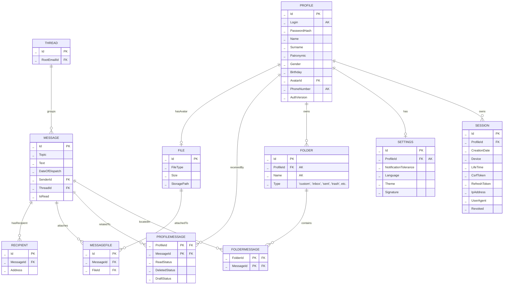

```mermaid
erDiagram
    PROFILE {
        _ Id PK
        _ Login "AK"
        _ PasswordHash
        _ Name
        _ Surname
        _ Patronymic
        _ Gender
        _ Birthday
        _ AvatarId FK
        _ PhoneNumber "AK"
        _ AuthVersion
    }
    MESSAGE {
        _ Id PK
        _ Topic
        _ Text
        _ DateOfDispatch
        _ SenderId FK
        _ ThreadId FK
        _ IsRead
    }
    THREAD {
        _ Id PK
        _ RootEmailId FK
    }
    RECIPIENT {
        _ Id PK
        _ MessageId FK
        _ Address
    }
    FILE {
        _ Id PK
        _ FileType
        _ Size
        _ StoragePath
    }
    MESSAGEFILE {
        _ Id PK
        _ MessageId FK
        _ FileId FK
    }
    PROFILEMESSAGE {
        _ ProfileId PK "FK"
        _ MessageId PK "FK"
        _ ReadStatus
        _ DeletedStatus
        _ DraftStatus
    }
    FOLDER {
        _ Id PK
        _ ProfileId FK "AK"
        _ Name "AK"
        _ Type  " 'custom', 'inbox', 'sent', 'trash', etc. "
    }
    FOLDERMESSAGE {
        _ FolderId PK "FK"
        _ MessageId PK "FK"
    }
    SETTINGS {
        _ Id PK
        _ ProfileId FK "AK"
        _ NotificationTolerance
        _ Language
        _ Theme
        _ Signature
    }
    SESSION {
        _ Id PK
        _ ProfileId FK
        _ CreationDate
        _ Device
        _ LifeTime
        _ CsrfToken
        _ RefreshToken
        _ IpAddress
        _ UserAgent
        _ Revoked
    }

    PROFILE ||--o{ SESSION : "owns"
    PROFILE ||--o| SETTINGS : "has"
    PROFILE ||--o{ FOLDER : "owns"
    FOLDER ||--o{ FOLDERMESSAGE : "contains"
    MESSAGE ||--o{ FOLDERMESSAGE : "locatedIn"
    MESSAGE ||--o{ PROFILEMESSAGE : "relatedTo"
    PROFILE ||--o{ PROFILEMESSAGE : "receivedBy"
    MESSAGE ||--o{ MESSAGEFILE : "attaches"
    FILE ||--o{ MESSAGEFILE : "attachedTo"
    PROFILE ||--o| FILE : "hasAvatar"
    MESSAGE ||--o{ RECIPIENT : "hasRecipient"
    THREAD ||--o{ MESSAGE : "groups"
```