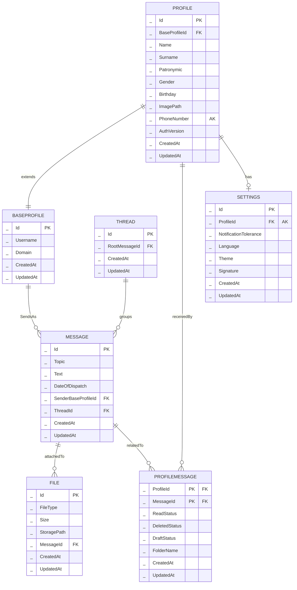

```mermaid
erDiagram
    BASEPROFILE{
        _ Id PK
        _ Username
        _ Domain
        _ CreatedAt
        _ UpdatedAt
    }
    PROFILE {
        _ Id PK
        _ BaseProfileId FK
        _ Name
        _ Surname
        _ Patronymic
        _ Gender
        _ Birthday
        _ ImagePath
        _ PhoneNumber "AK"
        _ AuthVersion
        _ CreatedAt
        _ UpdatedAt
    }
    MESSAGE {
        _ Id PK
        _ Topic
        _ Text
        _ DateOfDispatch
        _ SenderBaseProfileId FK
        _ ThreadId FK
        _ CreatedAt
        _ UpdatedAt
    }
    THREAD {
        _ Id PK
        _ RootMessageId FK
        _ CreatedAt
        _ UpdatedAt
    }
    FILE {
        _ Id PK
        _ FileType
        _ Size
        _ StoragePath
        _ MessageId FK
        _ CreatedAt
        _ UpdatedAt
    }
    PROFILEMESSAGE {
        _ ProfileId PK "FK"
        _ MessageId PK "FK"
        _ ReadStatus
        _ DeletedStatus
        _ DraftStatus
        _ FolderName 
        _ CreatedAt
        _ UpdatedAt
    }
    SETTINGS {
        _ Id PK
        _ ProfileId FK "AK"
        _ NotificationTolerance
        _ Language
        _ Theme
        _ Signature
        _ CreatedAt
        _ UpdatedAt
    }

    PROFILE ||--o| SETTINGS : "has"
    MESSAGE ||--o{ PROFILEMESSAGE : "relatedTo"
    PROFILE ||--o{ PROFILEMESSAGE : "receivedBy"
    MESSAGE ||--o{ FILE : "attachedTo"
    THREAD ||--o{ MESSAGE : "groups"
    PROFILE ||--|| BASEPROFILE : "extends"
    BASEPROFILE ||--o{ MESSAGE : "SendsAs"
```