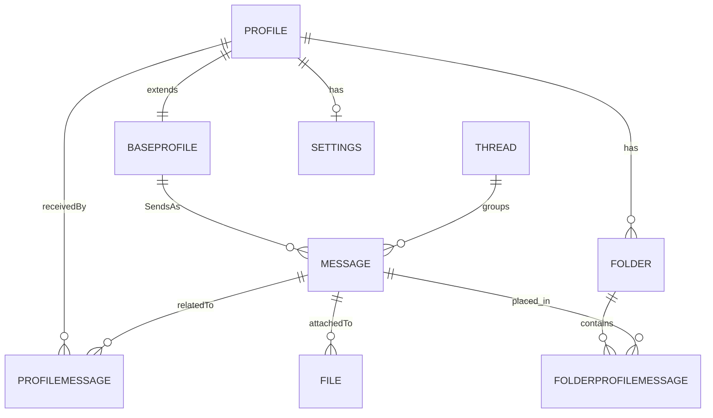
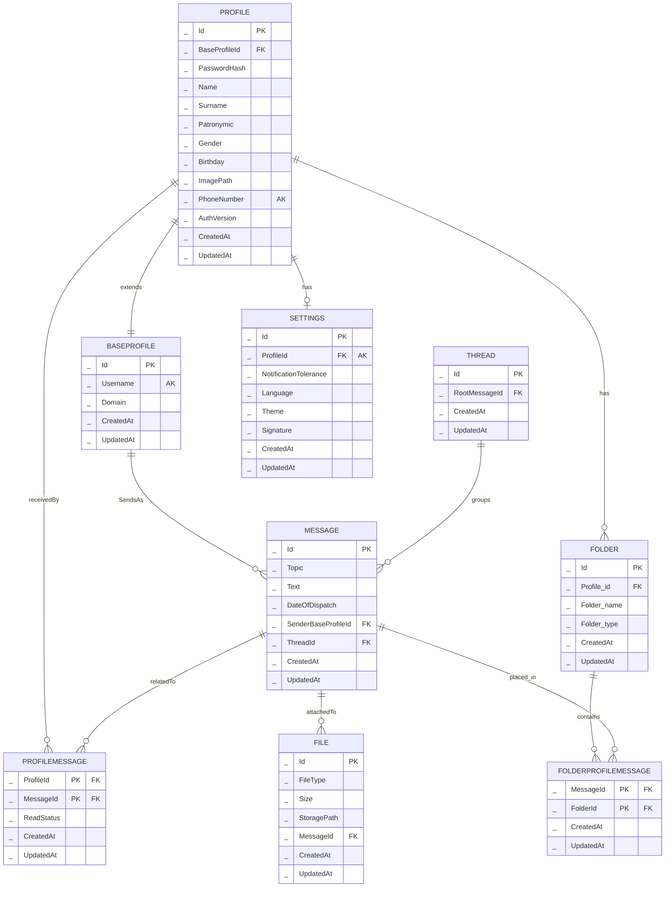

### BaseProfile
Базовая информация обо всех пользователях системы (внутренних и внешних)
- Id: Уникальный идентификатор пользователя в базе данных
- Username: Имя пользователя (часть email до @)
- Domain: Домен почты (часть email после @)
- CreatedAt: Дата и время создания записи
- UpdatedAt: Дата и время последнего обновления записи

### Profile
Расширенная информация о пользователях нашей почтовой системы
- Id: Уникальный идентификатор пользователя в базе данных
- BaseProfileId: Ссылка на базовый профиль в таблице BaseProfile
- PasswordHash: Хэш пароля пользователя
- Name: Имя пользователя
- Surname: Фамилия пользователя
- Patronymic: Отчество пользователя
- Gender: Пол пользователя
- Birthday: Дата рождения пользователя
- ImagePath: Путь к аватарке
- AuthVersion: Версия аутентификации
- CreatedAt: Дата и время создания записи
- UpdatedAt: Дата и время последнего обновления записи
### Message
Сообщения электронной почты
- Id: Уникальный идентификатор сообщения
- Topic: Тема сообщения
- Text: Текст сообщения
- DateOfDispatch: Дата и время отправки сообщения
- SenderBaseProfileId: Идентификатор отправителя (ссылка на BaseProfile)
- ThreadId: Идентификатор цепочки сообщений (ссылка на Thread)
- CreatedAt: Дата и время создания записи
- UpdatedAt: Дата и время последнего обновления записи
### Thread
Цепочки сообщений (треды)
- Id: Уникальный идентификатор цепочки сообщений
- RootMessage: Корневое сообщение цепочки (ссылка на Message)
- CreatedAt: Дата и время создания записи
- UpdatedAt: Дата и время последнего обновления записи
### Folder
Папки с сообщениями
- Id: Уникальный идентификатор папки с сообщениями
- Profile_id: Идентификатор пользователя
- Folder_name: Название папки
- Folder_type: Тип папки ('inbox', 'sent', 'draft', 'spam', 'trash', 'custom')
- CreatedAt: Дата и время создания записи
- UpdatedAt: Дата и время последнего обновления записи
### File
Прикрепленные файлы
- Id: Уникальный идентификатор файла
- FileType: Тип файла (MIME-тип)
- Size: Размер файла в байтах
- StoragePath: Путь к файлу в системе хранения
- MessageId: Идентификатор сообщения, к которому прикреплен файл
- CreatedAt: Дата и время создания записи
- UpdatedAt: Дата и время последнего обновления записи
### FolderProfileMessage
Связь пользователя, сообщения и папки(для нахождения сообщения у одного пользователя в нескольких папках)
- MessageId: Идентификатор сообщения (часть составного ключа)
- FolderId: Идентификатор папки (часть составного ключа)
- CreatedAt: Дата и время создания записи
- UpdatedAt: Дата и время последнего обновления записи
### ProfileMessage
Связь пользователей с сообщениями (статусы)
- ProfileId: Идентификатор пользователя (часть составного ключа)
- MessageId: Идентификатор сообщения (часть составного ключа)
- ReadStatus: Статус прочтения сообщения пользователем
- CreatedAt: Дата и время создания записи
- UpdatedAt: Дата и время последнего обновления записи
### Settings
Настройки пользователей
- Id: Уникальный идентификатор настроек
- ProfileId: Идентификатор пользователя, к которому относятся настройки
- NotificationTolerance: Настройка уведомлений
- Language: Язык интерфейса пользователя
- Theme: Тема оформления интерфейса
- Signature: Подпись пользователя в письмах
- CreatedAt: Дата и время создания записи
- UpdatedAt: Дата и время последнего обновления записи

## ER-диаграмма (min)



## ER-диаграмма



## Функциональные зависимости

### BASEPROFILE
```text
{Id} → {Username, Domain, CreatedAt, UpdatedAt}
{Username} → {Id, Domain, CreatedAt, UpdatedAt}  
{Username, Domain} → {Id, CreatedAt, UpdatedAt} 
```
PROFILE
```text
{Id} → {BaseProfileId, PasswordHash, Name, Surname, Patronymic, Gender, Birthday, ImagePath, PhoneNumber, 
AuthVersion, CreatedAt, UpdatedAt}
{PhoneNumber} → {Id}
{BaseProfileId} → {Id}
```
### MESSAGE
```text
{Id} → {Topic, Text, DateOfDispatch, SenderBaseProfileId, ThreadId, CreatedAt, UpdatedAt}
```
### THREAD
```text
{Id} → {RootMessageId, CreatedAt, UpdatedAt}
```
### FOLDER
```text
{Id} → {ProfileId, FolderName, FolderType, CreatedAt, UpdatedAt}
```
### FILE
```text
{Id} → {FileType, Size, StoragePath, MessageId, CreatedAt, UpdatedAt}
```
### FOLDERPROFILEMESSAGE
```text
{MessageId, FolderId} → {CreatedAt, UpdatedAt}
```
### PROFILEMESSAGE
```text
{ProfileId, MessageId} → {ReadStatus, CreatedAt, UpdatedAt}
```
### SETTINGS
```text
{Id} → {ProfileId, NotificationTolerance, Language, Theme, Signature, CreatedAt, UpdatedAt}
{ProfileId} → {Id}
```

### Доказательство соответствия нормальным формам

#### 1. Первая нормальная форма (1NF)
Все атрибуты атомарны, отсутствуют повторяющиеся группы и составные типы данных.

#### 2. Вторая нормальная форма (2NF)
Отсутствуют частичные зависимости неключевых атрибутов от составных первичных ключей.

#### 3. Третья нормальная форма (3NF)
Отсутствуют транзитивные зависимости неключевых атрибутов.

#### 4. Нормальная форма Бойса-Кодда (НФБК)
Каждый детерминант является потенциальным ключом.
