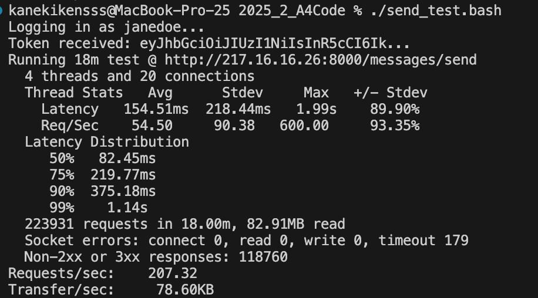
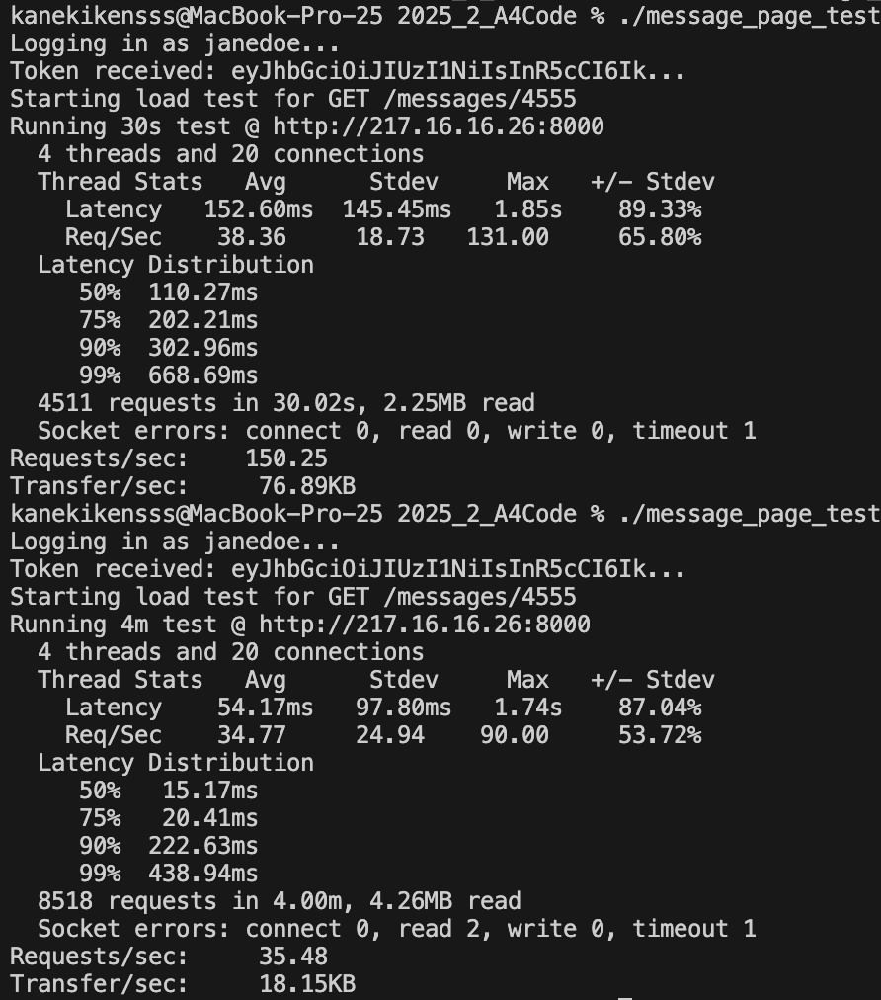

Документация по нагрузочному тестировании основной сущности почты - писем.

Для проведения тестирования выбран следующий инструмент: https://github.com/wg/wrk

Исходный ddl базы данных представлен в текущей директории, файл init.sql

При тестировании эндпоинта messages/send было создано 105171 письмо. Была использована команда send_test.bash 
Результат представлен в файле send_res.png

Результаты показывают значительные проблемы с производительностью и стабильностью эндпоинта:
1) Низкая надежность (53% ошибок). Из 223,931 запросов 118,760 получили не успешные (не 2хх/3хх) ответы. Это говорит о том, что система не справляется с поступающей нагрузкой.
2) Высокая задержка на пике. 99-й процентиль задержки (Latency) составил 1.14 секунды
3) Приемлемая средняя пропускная способность (207.32 запросов в секунду)

При тестировании эндпоинта messages/{message_id} были получены результаты, представленные в message_page_res.png
Были выполнены две команды из message_page_test.bash :
    Короткий 30-секундный тест показал относительно стабильную, но уже высокую задержку (99-й перцентиль — 668.69 мс). Однако главные проблемы проявились в 4-минутном тесте: производительность упала более чем в 4 раза — с 150 до 35 запросов в секунду. При этом характер задержки изменился радикально: 50% запросов стали выполняться очень быстро (15.17 мс), но при этом сохранился «хвост» из крайне медленных операций (90-й перцентиль — 222.63 мс).

Результаты нагрузочного тестирования выявили критические проблемы с масштабируемостью системы. 
Для исправления этих проблем можно использовать следующие инструменты:
1)Анализ планов выполнения запросов (EXPLAIN ANALYZE) — для выявления медленных операций (Seq Scan, дорогие JOIN) и определения, каких индексов не хватает.
2)Добавление недостающих индексов — следует создавать индексы для полей, участвующих в WHERE, JOIN и ORDER BY. Например, для быстрого поиска сообщений по получателю: CREATE INDEX ON profile_message (profile_id, read_status).
3)Мониторинг блокировок (pg_locks, pg_stat_activity) — поможет обнаружить взаимоблокировки (deadlocks) или долгие транзакции, которые парализуют запись и могут быть причиной таймаутов и падения RPS.
